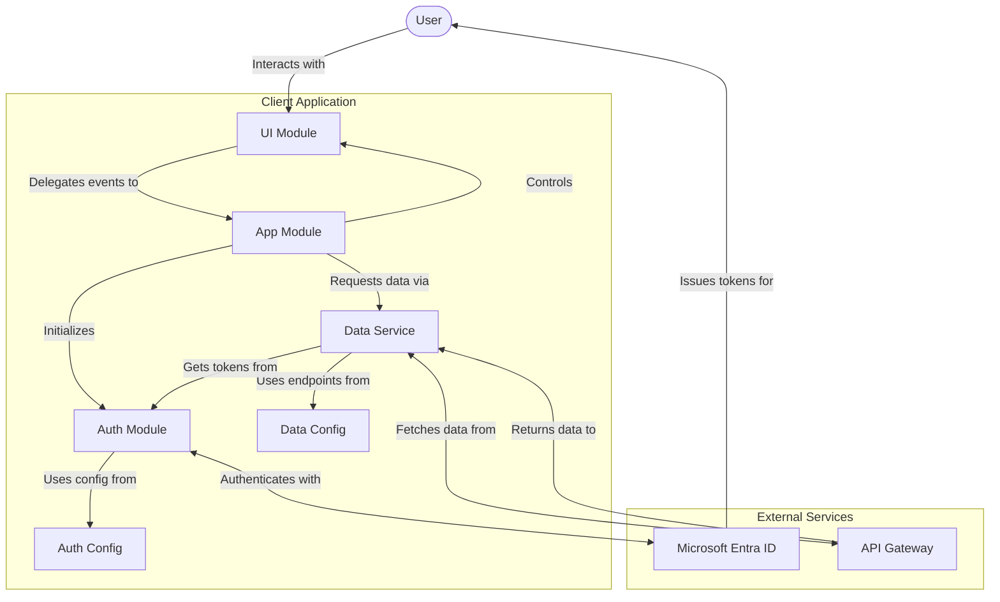
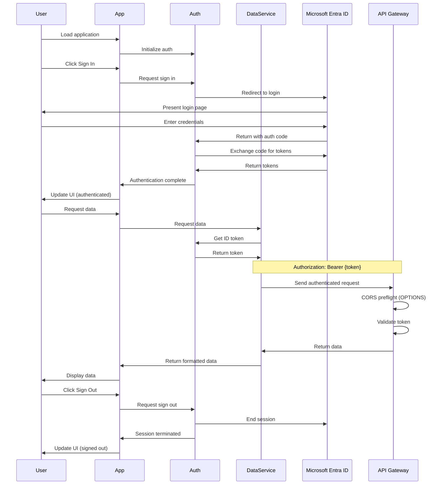
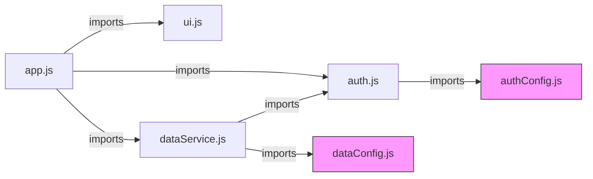

# Simple Authenticated Web App Architecture

This document outlines the technical architecture and flow of the Simple Authenticated Web App. The application is built as a modular client-side JavaScript application that authenticates users with Microsoft Entra ID and retrieves data from secure APIs.

## Overall Architecture

The application follows a modular architecture with clear separation of concerns:

- The core application logic coordinates authentication flow and initialization
- Authentication is handled through Microsoft Entra ID (Azure AD) using MSAL.js
- Data services manage API communication with authentication tokens
- UI components handle rendering and user interactions

## Module Structure

The application is structured into several key JavaScript modules:

| Module | Responsibility |
|--------|----------------|
| `app.js` | Main application coordinator that initializes components and manages flow |
| `auth.js` | Handles authentication with Microsoft Entra ID using MSAL.js |
| `authConfig.js` | Configuration parameters for Microsoft authentication |
| `dataService.js` | Manages authenticated API calls and data caching |
| `dataConfig.js` | Configuration for API endpoints |
| `ui.js` | Handles DOM manipulation and user interface interactions |

## Application Flow

1. **Initialization**:
   - The application starts when the DOM is loaded
   - The app checks if MSAL.js is available and loads it if not
   - Auth module is initialized with configuration from authConfig.js

2. **Authentication Flow**:
   - On first load, the app checks for existing authentication or handles redirect from auth provider
   - User can click "Sign In" to begin authentication with Microsoft Entra ID
   - Auth module redirects to Microsoft login page
   - After successful login, Microsoft redirects back to the application
   - MSAL.js handles the token acquisition and storage
   - User information is fetched from Microsoft Graph API

3. **Data Retrieval Flow**:
   - After authentication, data can be fetched from configured API endpoints
   - The ID token from authentication is used as a bearer token
   - API requests are sent with proper authorization headers
   - Responses are cached in memory to minimize redundant API calls
   - UI is updated to display the fetched data

4. **Component Interaction**:
   - App module coordinates between auth, data, and UI modules
   - UI module responds to user interactions and delegates to app module
   - Auth module maintains authentication state and tokens
   - Data service module handles API communication and caching

## Security Considerations

- Tokens are stored in memory only, not persisted to localStorage or cookies
- API calls include proper authorization headers using bearer tokens
- Authentication uses industry-standard OAuth 2.0 and OpenID Connect protocols
- CORS preflight requests are automatically handled by the browser for authenticated API calls

## Technical Details

### Authentication Flow

The authentication uses the OAuth 2.0 authorization code flow with PKCE, implemented through MSAL.js:

1. App initializes MSAL with configuration
2. User triggers sign-in, which redirects to Microsoft Entra ID
3. User authenticates on Microsoft's login page
4. Authorization code is returned to the app
5. MSAL exchanges the code for tokens
6. Tokens are stored in memory
7. ID token is used to display user information
8. Access token is used for API calls

### API Communication

The application communicates with backend APIs using the following pattern:

1. Retrieves the ID token from the auth module
2. Constructs a fetch request with the token in the Authorization header
3. Sends the request to the configured endpoint
4. Handles the response, including error cases
5. Caches the successful response for future use
6. Updates the UI with the retrieved data

## Component Diagram

## Data Flow Diagram

## Module Dependencies

## Environment Requirements

The application is designed to run in any modern web browser with JavaScript enabled. It requires:

1. Network connectivity to Microsoft authentication services
2. Network connectivity to the configured API endpoints
3. Support for modern JavaScript features (ES6+)
4. CORS support for cross-origin API requests

## Development Principles

This project follows these development principles:

1. **Modular Code**: Uses ES Modules to break up functionality into logical units
2. **Size Limitations**: JavaScript files are kept under 200 lines for maintainability
3. **No Magic Values**: Constants are used instead of hardcoded values
4. **Documentation**: Comprehensive comments explain what the code does
